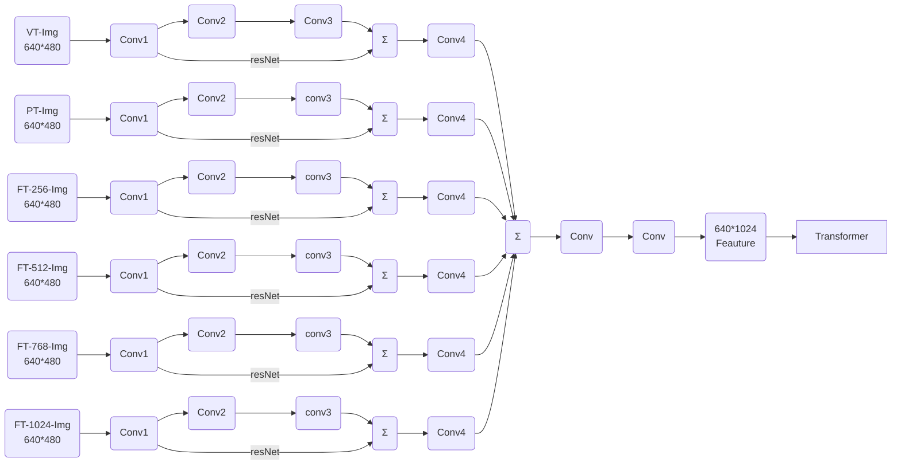

```mermaid
flowchart LR
    i1(VT-Img\n640*480)
    conv1(Conv1)
    conv2(Conv2)
    conv3(Conv3)
    sum1(Σ)
    conv4(Conv4)
    i1-->conv1-->conv2-->conv3-->sum1-->conv4
    conv1--resNet-->sum1
    i2(PT-Img\n640*480)
    conv2_1(Conv1)
    conv2_2(Conv2)
    conv2_3(conv3)
    sum2_1(Σ)
    conv2_4(Conv4)
    i2-->conv2_1-->conv2_2-->conv2_3-->sum2_1-->conv2_4
    conv2_1--resNet-->sum2_1
    i3(FT-256-Img\n640*480)
    conv3_1(Conv1)
    conv3_2(Conv2)
    conv3_3(conv3)
    conv3_4(Conv4)
    sum3_1(Σ)
    i3-->conv3_1-->conv3_2-->conv3_3-->sum3_1-->conv3_4
    conv3_1--resNet-->sum3_1
    i4(FT-512-Img\n640*480)
    conv4_1(Conv1)
    conv4_2(Conv2)
    conv4_3(conv3)
    conv4_4(Conv4)
    sum4_1(Σ)
    i4-->conv4_1-->conv4_2-->conv4_3-->sum4_1-->conv4_4
    conv4_1--resNet-->sum4_1
    i5(FT-768-Img\n640*480)
    conv5_1(Conv1)
    conv5_2(Conv2)
    conv5_3(conv3)
    conv5_4(Conv4)
    sum5_1(Σ)
    i5-->conv5_1-->conv5_2-->conv5_3-->sum5_1-->conv5_4
    conv5_1--resNet-->sum5_1
    i6(FT-1024-Img\n640*480)
    conv6_1(Conv1)
    conv6_2(Conv2)
    conv6_3(conv3)
    conv6_4(Conv4)
    sum6_1(Σ)
    i6-->conv6_1-->conv6_2-->conv6_3-->sum6_1-->conv6_4
    conv6_1--resNet-->sum6_1
    sum(Σ)
    conv4 & conv2_4 & conv3_4 & conv4_4 & conv5_4 & conv6_4 --> sum --> C(Conv) --> C2(Conv) --> Res(640*1024\nFeauture) --> T[Transformer]
```